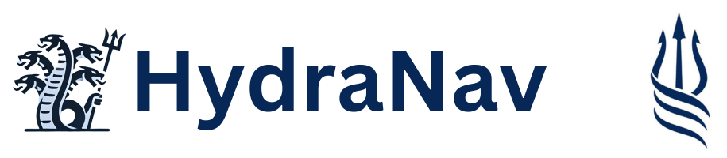
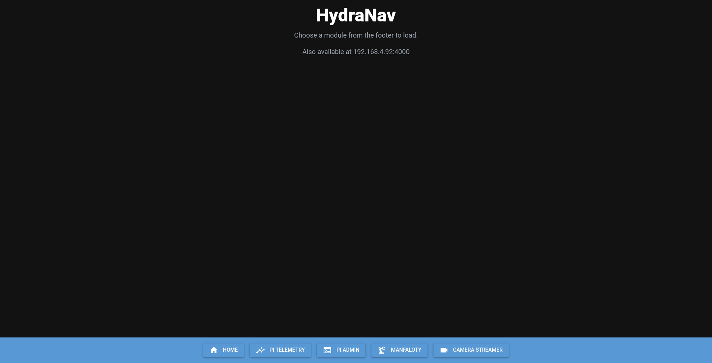
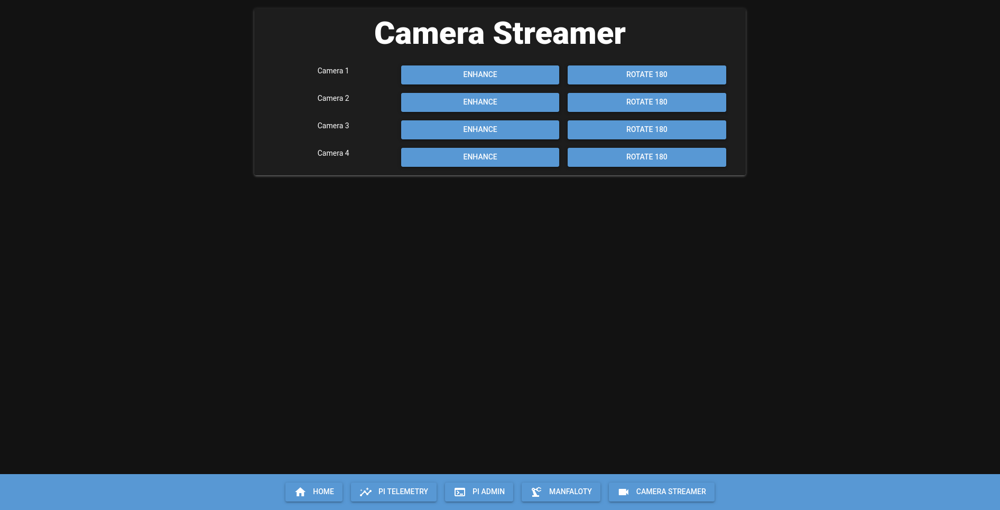
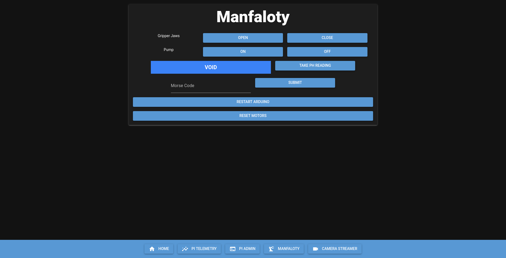
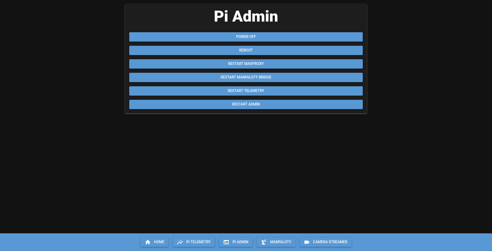
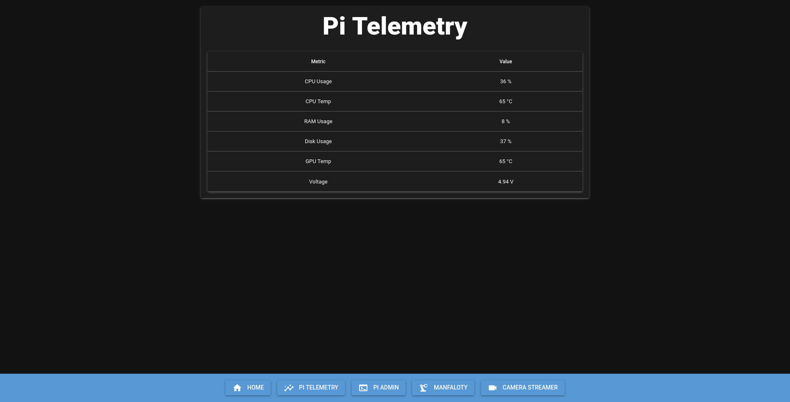

# HydraNav

Revolutionary Ground Control Station (GCS) from TritonROVs - A comprehensive control system for underwater ROVs providing seamless integration with various controllers, real-time telemetry, and advanced autopilot features.

## Overview

HydraNav is a modular, Python-based Ground Control Station designed for underwater ROV (Remotely Operated Vehicle) operations. It features a sophisticated architecture built around event-driven communication, real-time telemetry, and multi-modal input handling.

## Table of Contents

- [WebGUI Screenshots](#webgui-screenshots)
  - [Home Dashboard](#home-dashboard)
  - [Camera Streamer](#camera-streamer)
  - [Manfaloty Control System](#manfaloty-control-system)
  - [Pi Administration Panel](#pi-administration-panel)
  - [Telemetry Dashboard](#telemetry-dashboard)
- [System Architecture](#system-architecture)
  - [Core Components](#core-components)
  - [System Modules](#system-modules)
  - [Communication Architecture](#communication-architecture)
  - [Operating Modes](#operating-modes)
- [Project Journey & Status](#project-journey--status)
  - [The Development Experience](#the-development-experience)
  - [Current Status: Retirement](#current-status-retirement)
  - [Future Potential](#future-potential)
  - [Legacy](#legacy)
- [License](#license)

## WebGUI Screenshots

### Home Dashboard

### Camera Streamer

### Manfaloty Control System

### Pi Administration Panel

### Telemetry Dashboard

## System Architecture

### Core Components

**Module Manager (`core/module_manager.py`)**
- Central orchestrator managing all system modules
- Handles module lifecycle (initialization, updates, shutdown)
- Provides graceful shutdown with timeout handling
- Manages inter-module communication and dependencies

**Event Dispatcher (`core/event_dispatcher.py`)**
- Event-driven architecture for loose coupling between modules
- Pub/sub pattern for real-time communication
- Supports event subscription, unsubscription, and broadcasting

**Configuration Manager (`core/config_manager.py`)**
- YAML-based configuration system with validation
- Default configuration fallback mechanism
- Supports multiple controller mappings and network settings
- JSON schema validation for controller configurations

**Request Manager (`core/request_manager.py`)**
- Handler registry for command execution
- Enables modules to expose callable endpoints
- Supports both synchronous requests and event-based communication

### System Modules

**Autopilot (`autopilot/`)**
- MAVLink communication with ROV flight controller
- PWM channel control for thrusters and servos
- Support for ARMED/DISARMED states and flight modes (Manual/Stabilize)
- Configurable gain levels and safety timeouts
- Real-time sensor data acquisition

**User Input (`controller_input/`, `keyboard_input/`)**
- Multi-controller support with hot-swappable configurations
- Joystick deadzone handling and sensitivity adjustment  
- Configurable button mappings with hold/press detection
- Support for Xbox, PlayStation, and custom controllers

**Manfaloty System (`manfaloty/`)**
- Communication bridge for gripper and camera control
- pH sensor data acquisition with real-time readings
- Pump control for sampling operations
- Multi-threaded daemon architecture for concurrent operations

**Pi Administration (`pi_admin/`)**
- Remote system administration capabilities
- Service restart commands (MAVProxy, telemetry, gripper)
- System power control (reboot, shutdown)
- Network-based daemon communication

**Telemetry (`pi_telemetry/`)**
- Real-time system status monitoring
- CPU usage, memory consumption, and temperature readings
- Network-based data streaming
- Queue-based data buffering for reliability

**Web GUI (`web_gui/`)**
- Modern web-based control interface using NiceGUI
- Responsive design with dark theme
- Modular page system for different subsystems
- Real-time status displays and control panels

**Camera Streamer (`camera_streamer/`)**
- Multi-camera support with OpenCV integration
- Real-time video streaming capabilities
- Configurable resolution and frame rate settings

**Audio Notifications (`notifier/`)**
- Event-driven audio feedback system
- Pygame-based audio playback
- Volume control and asset management
- Contextual notifications for system states

### Communication Architecture

**Network Topology**
- Base IP: `0.0.0.0` (configurable)
- Raspberry Pi: `192.168.1.100` (configurable)
- Service ports:
  - 2000: MAVProxy router
  - 2005: Manfaloty/Gripper daemon  
  - 2010: Telemetry daemon
  - 2015: Admin daemon
  - 4000: Web GUI server

**Inter-Process Communication**
- Multiprocessing queues for thread-safe data exchange
- Event-based messaging for real-time updates
- Socket-based network communication with timeout handling
- Structured data serialization using Python's struct module

### Operating Modes

**Normal Mode**
- Full GCS functionality including autopilot and GUI
- Complete telemetry and control capabilities
- Audio notifications and visual feedback

**Companion Mode** (`--companion` flag)
- Lightweight operation for embedded systems
- Excludes autopilot and heavy GUI components
- Optimized for headless operation on companion computers

## Project Journey & Status

This project holds special significance as my first large-scale software development endeavor. HydraNav began as an ambitious undertaking that evolved through countless iterations, architectural decisions, and learning experiences over an extended development period.

### The Development Experience

Working on HydraNav was a transformative journey that pushed the boundaries of my programming knowledge. From initially grappling with basic Python concepts to eventually implementing sophisticated multi-threaded architectures, event-driven systems, and real-time communication protocols, this project became a comprehensive learning laboratory.

The system went through multiple redesigns as I discovered better patterns and practices:
- Early versions relied on simple sequential execution
- Mid-development introduced threading for concurrent operations  
- The final architecture embraced a fully modular, event-driven design with multiprocessing

Each module taught me something new - from network programming with the telemetry system to real-time graphics with the GUI components, from hardware interfacing with the controller input to distributed system design with the various daemon processes.

### Current Status: Retirement

With the conclusion of the 2025 ROV season, HydraNav has officially entered retirement from active development. The end of the competitive season naturally marked the completion of this chapter, as the driving motivation and operational need for continued development has concluded.

While the system is far from complete—and likely never will be in the truest sense—it has reached a functional state that reflects significant learning and growth. This project represents my dedication to understanding software development principles, encompassing countless hours of experimentation, debugging, and gradual architectural improvements.

### Future Potential

Despite its retirement status, HydraNav remains a solid foundation with numerous opportunities for enhancement:
- Enhanced GUI components and user experience improvements
- Additional sensor integrations and telemetry capabilities
- Advanced autopilot features and autonomous mission planning
- Mobile companion applications
- Enhanced video processing and computer vision features
- Cloud connectivity and remote monitoring capabilities

The modular architecture was specifically designed to accommodate such expansions, making it relatively straightforward for future contributors to extend the system's capabilities.

### Legacy

HydraNav represents a significant learning experience in software development. From simple beginnings to a more sophisticated, multi-threaded system, this project documents the gradual evolution of technical understanding and engineering approaches.

Though it may never be "complete" in the traditional sense, HydraNav serves as a practical exploration of complex system design. The project functions as both a personal learning milestone and a working example for others interested in ROV control systems and event-driven architectures.

### Open Source Release

HydraNav is released under the GPL v3 license to make it available as a reference for others working on similar projects. The decision to open source this work comes from the idea that sharing code and experiences can be helpful to the broader community.

The codebase, documentation, and implementation approach might be useful for:
- Educational projects in robotics and control systems
- Other ROV teams building control systems
- Those exploring event-driven architectures
- Developers working with multi-threaded Python applications

While active development has ended, the code remains available for anyone who might find it useful or want to build upon it. The GPL license ensures that any modifications remain accessible to others.

The 2025 season may have ended, but the knowledge, experience, and satisfaction gained from this journey will endure far beyond any single competition or deadline.

## License

This project is licensed under the GNU General Public License v3.0 - see the [LICENSE](LICENSE) file for details.

HydraNav is free software: you can redistribute it and/or modify it under the terms of the GNU General Public License as published by the Free Software Foundation, either version 3 of the License, or (at your option) any later version.

This program is distributed in the hope that it will be useful, but WITHOUT ANY WARRANTY; without even the implied warranty of MERCHANTABILITY or FITNESS FOR A PARTICULAR PURPOSE. See the GNU General Public License for more details.

