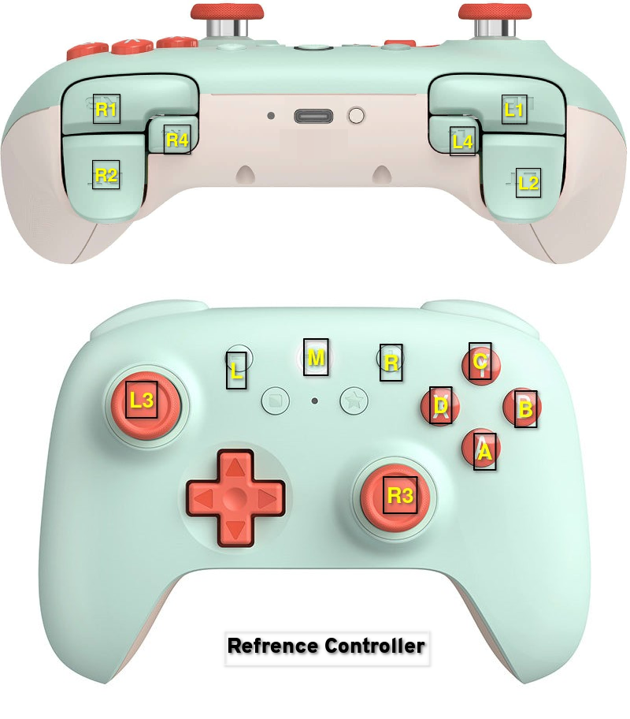

user\_input.controller module
=============================

Class responsible for managing controller connection/disconnection, joystick calibration and dispatching events.

Controller button/axes mappings are based on a virtual controller, to map to the read world, every controller must have a configuration json file. 

The file specifies what pygame button ids or axes map to the virtual controller.

Virtual Controller:
===================

Example Configuration:
======================

.. literalinclude:: ./controller_example_config.json
   :language: JSON

The previous configuration is for the 8bit-do bluetooth controller, the values on the right-hand-side are retrieved from printing button/axes values while using `pygame-ce` 

The configuration is validated in the `Controller` class using a json schema.

.. automodule:: user_input.controller
   :members:
   :show-inheritance:
   :undoc-members: