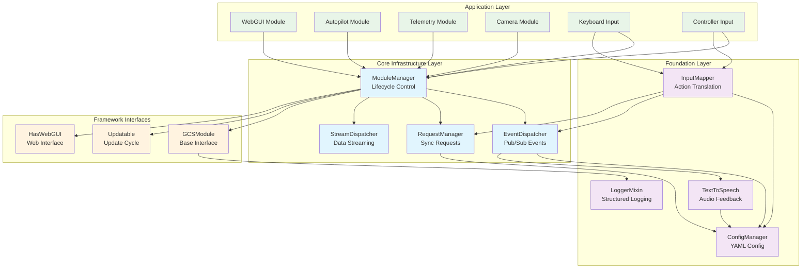
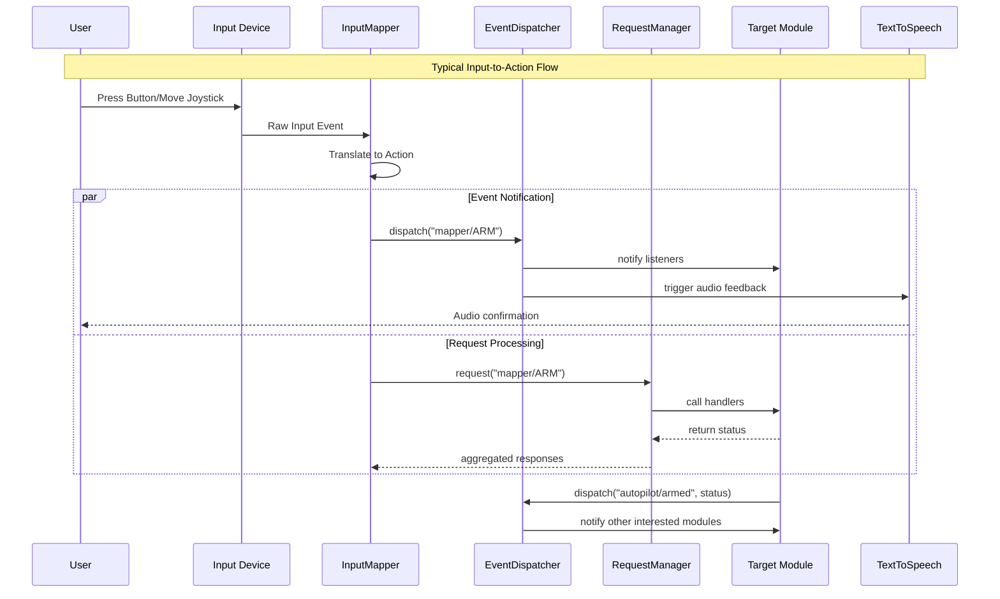
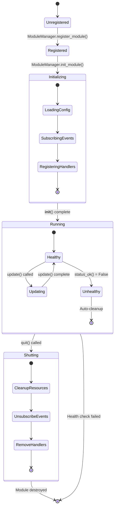
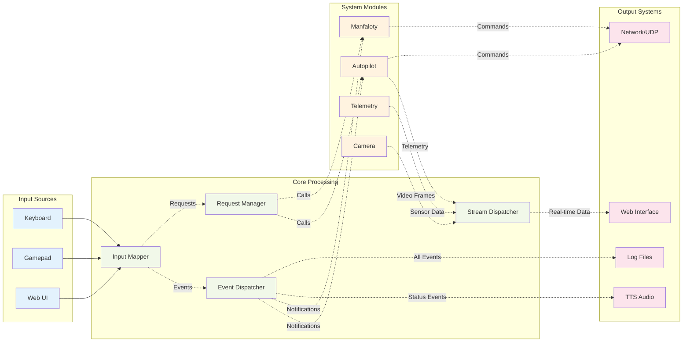

# HydraNav Core Module

The `core` module is the foundational backbone of HydraNav, providing essential system-wide services and infrastructure. This module implements the core architectural patterns, lifecycle management, configuration, logging, event handling, and inter-module communication systems that all other modules depend on.

## Table of Contents

- [Architecture Overview](#architecture-overview)
- [Configuration Management](#configuration-management)
  - [ConfigManager](#configmanager)
- [Event System](#event-system)
  - [EventDispatcher](#eventdispatcher)
- [Module Lifecycle Management](#module-lifecycle-management)
  - [ModuleManager](#modulemanager)
- [Logging Infrastructure](#logging-infrastructure)
  - [LoggerMixin](#loggermixin)
- [Request-Response System](#request-response-system)
  - [RequestManager](#requestmanager)
- [Inter-Process Communication](#inter-process-communication)
  - [StreamDispatcher](#streamdispatcher)
- [Text-to-Speech System](#text-to-speech-system)
  - [TTS (TextToSpeech)](#tts-texttospeech)
- [Input Mapping System](#input-mapping-system)
  - [InputMapper](#inputmapper)
- [Module Framework Interfaces](#module-framework-interfaces)
  - [GCSModule (Abstract Base)](#gcsmodule-abstract-base)
  - [Updatable (Mixin Interface)](#updatable-mixin-interface)
  - [HasWebGUI (Interface)](#haswebgui-interface)
- [Integration Patterns](#integration-patterns)
- [Technical Considerations](#technical-considerations)

## Architecture Overview

The core module establishes a hierarchical system where configuration drives initialization, events coordinate behavior, modules provide functionality, and managers orchestrate the entire system lifecycle.

### System Architecture Layers



### Communication Patterns



### Module Lifecycle



### Data Flow Architecture



---

## Configuration Management

### ConfigManager

**File:** `config_manager.py`

The configuration system provides centralized, YAML-based configuration management with validation and fallback mechanisms.

#### Architecture
- **Default Configuration**: Built-in fallback configuration ensuring system always has valid settings
- **File-based Override**: User configuration in `~/.config/HydraNav/config.yaml`
- **Validation System**: Required fields checking with module-specific validation
- **Dynamic Access**: Runtime configuration access via tuple notation

#### Core Features
```python
# Access configuration values
ip_address = config_manager["networking", "baseIP"]
controller_dead_zone = config_manager["controller", "joystickDeadZone"]

# Validation ensures all required fields are present
REQUIRED_FIELDS = {
    "networking": ("baseIP", "raspIP", "retryDelaySec", "socketTimeout"),
    "autopilot": ["port", "maxBackwardPWM", "maxForwardPWM", ...],
    # ... other modules
}
```

#### Configuration Sections
- **Networking**: Base/Pi IP addresses, timeouts, retry settings
- **Autopilot**: PWM ranges, gain levels, sensor rates
- **Controllers**: Joystick mappings, dead zones, device configurations
- **TTS**: Voice model selection and generation timeouts
- **Modules**: Port assignments and module-specific parameters

#### Usage Pattern
```python
from hydranav.core.config_manager import config_manager

# Get configuration value with automatic validation
try:
    port = config_manager["autopilot", "port"]
except InvalidConfigModule:
    # Handle missing module config
except InvalidConfigItem:
    # Handle missing config item
```

---

## Event System

### EventDispatcher

**File:** `event_dispatcher.py`

A publish-subscribe event system enabling loose coupling between modules through asynchronous event communication.

#### Architecture
- **Event Objects**: Structured events with type and optional data payload
- **Subscription Registry**: Type-based listener registration system
- **Error Isolation**: Exception handling prevents listener failures from cascading
- **Flexible Dispatch**: Support for both Event objects and string-based events

#### Core Components
```python
class Event:
    def __init__(self, event_type: str, data: Any = None):
        self.event_type = event_type
        self.data = data

class EventDispatcher:
    def subscribe(self, event_type: str, listener: Callable)
    def unsubscribe(self, event_type: str, listener: Callable)
    def dispatch(self, event: Event | str, data: Any = None)
```

#### Usage Patterns
```python
from hydranav.core.event_dispatcher import event_dispatcher

# Subscribe to events
event_dispatcher.subscribe("autopilot/armed", handle_armed_state)
event_dispatcher.subscribe("controller/button_pressed", handle_button)

# Dispatch events
event_dispatcher.dispatch("system/startup")
event_dispatcher.dispatch("telemetry/update", sensor_data)

# Automatic error handling prevents system crashes
# If handle_armed_state() throws an exception, other listeners still execute
```

---

## Module Lifecycle Management

### ModuleManager

**File:** `module_manager.py`

The central orchestrator managing the complete lifecycle of all HydraNav modules from initialization through graceful shutdown.

#### Architecture
- **Registration System**: Dynamic module discovery and registration
- **Initialization Ordering**: Priority-based startup sequence
- **Health Monitoring**: Continuous status checking with automatic cleanup
- **Graceful Shutdown**: Signal handling with timeout-based termination

#### Core Lifecycle
```python
class ModuleManager:
    def init_modules(self, module_classes: list[type[GCSModule]])
    def update_all(self)  # Called in main loop
    def shutdown(self)    # Graceful termination
    def get_module_status_ok(self, module: str) -> bool
```

#### Module Health Monitoring
- **Status Checking**: Regular `status_ok()` polling for each module
- **Automatic Cleanup**: Failed modules are automatically unregistered
- **Health Events**: Status changes trigger `module-manager/module-down` events
- **Process Management**: Multiprocess coordination and cleanup

#### Shutdown Sequence
1. **Signal Handling**: SIGINT triggers graceful shutdown
2. **Module Iteration**: Each module's `quit()` method called
3. **Process Termination**: Child processes terminated and joined
4. **System Exit**: Clean OS-level exit with `os._exit(0)`

---

## Logging Infrastructure

### LoggerMixin

**File:** `logger.py`

A sophisticated logging system providing colored output, contextual formatting, and hierarchical logger management.

#### Architecture
- **Mixin Pattern**: Inherited by all major classes for consistent logging
- **Colored Output**: Level-based color coding using `colorlog`
- **Context Filtering**: Automatic class name extraction for logger naming
- **Custom Levels**: Added `SUCCESS` level for positive feedback
- **Universal Control**: System-wide logging level management

#### Logger Hierarchy
```python
class LoggerMixin:
    _parent_logger = logging.getLogger("HydraNav")
    
    def __init__(self):
        class_name = self.__class__.__name__
        self._logger = logging.getLogger(f"HydraNav.{class_name}")
```

#### Output Format
```
02:34:56 PM | INFO     | ConfigManager      | Loaded config: {...}
02:34:57 PM | SUCCESS  | ModuleManager      | autopilot has been quit
02:34:58 PM | ERROR    | EventDispatcher    | 'handle_button' produced an error: ...
```

#### Usage Pattern
```python
class MyModule(LoggerMixin):
    def __init__(self):
        super().__init__()
        self._logger.info("Module initialized")
        self._logger.success("Operation completed")
        self._logger.error("Something went wrong")
```

---

## Request-Response System

### RequestManager

**File:** `request_manager.py`

A synchronous request-response system for inter-module communication requiring immediate responses or return values.

#### Architecture
- **Handler Registry**: Multiple handlers per request name
- **Return Aggregation**: Collects responses from all handlers
- **Debug Tracing**: Detailed logging of request routing
- **Dynamic Registration**: Runtime handler addition/removal

#### Core Operations
```python
class RequestManager:
    def register_handler(self, name: str, handler: Callable)
    def remove_request(self, name: str)
    def request(self, name: str, *args, **kwargs) -> list[Any]
```

#### Usage Pattern
```python
from hydranav.core.request_manager import request_manager

# Register handler
request_manager.register_handler("autopilot/get_status", get_autopilot_status)

# Make request (returns list of all handler responses)
responses = request_manager.request("autopilot/get_status")
status = responses[0] if responses else None
```

---

## Inter-Process Communication

### StreamDispatcher

**File:** `stream_manager.py`

A high-performance streaming system for real-time data distribution across process boundaries using multiprocessing pipes.

#### Architecture
- **Pipe-based Streams**: Multiprocessing.Pipe for efficient IPC
- **Connection Management**: Automatic cleanup of broken connections
- **Raw Bytes Support**: Optimized binary data streaming
- **Stream Multiplexing**: Multiple consumers per stream

#### Core Operations
```python
class StreamDispatcher:
    def dispatch(self, stream_name: str, data: Any, raw_bytes: bool = False)
    def request_stream(self, stream_name: str) -> Connection
    def remove_connection(self, stream_name: str, connection: Connection)
```

#### Usage Pattern
```python
from hydranav.core.stream_manager import stream_dispatcher

# Producer side
stream_dispatcher.dispatch("telemetry/sensors", sensor_data)
stream_dispatcher.dispatch("camera/frame", frame_bytes, raw_bytes=True)

# Consumer side
stream_conn = stream_dispatcher.request_stream("telemetry/sensors")
data = stream_conn.recv()  # Blocking receive
```

---

## Text-to-Speech System

### TTS (TextToSpeech)

**File:** `tts.py`

An intelligent text-to-speech system with line pre-generation, caching, and event-driven playback for system notifications.

#### Architecture
- **Line Registration**: Pre-hash text for efficient lookup
- **Background Generation**: Multiprocess TTS generation with timeouts
- **Disk Caching**: Persistent audio file storage
- **Event Integration**: Automatic playback on specific events

#### Core Features
```python
class TextToSpeech:
    def register_line(self, line: str) -> LineID
    def play_line(self, line_id: LineID)
    def attach_to_event(self, line_id: LineID, event: str)
    def update_and_generate_lines(self)
```

#### Implementation Details
- **Hashing**: xxHash for consistent line IDs
- **Model**: Piper neural TTS with configurable models
- **Storage**: `~/.local/share/HydraNav/tts/recordings/`
- **Generation**: Process isolation prevents blocking

#### Usage Pattern
```python
from hydranav.core.tts import TTS

# Register lines (typically at module startup)
STARTUP_LINE = TTS.register_line("System Starting")
ERROR_LINE = TTS.register_line("System Error Detected")

# Attach to events
TTS.attach_to_event(STARTUP_LINE, "system/startup")
TTS.attach_to_event(ERROR_LINE, "system/error")

# Manual playback
TTS.play_line(STARTUP_LINE)
```

---

## Input Mapping System

### InputMapper

**File:** `input_mapper.py`

A flexible input abstraction layer that translates raw controller/keyboard inputs into semantic actions through configurable mappings.

#### Architecture
- **Mapping Configurations**: Named input schemes loaded from config
- **Input Translation**: Raw inputs → semantic actions
- **Dual Dispatch**: Events for listeners, requests for immediate handlers
- **Hold Support**: Separate handling for held inputs

#### Core Operations
```python
class InputMapper:
    def digital_input(self, button: str)
    def digital_input_hold(self, button: str)
    def analogue_input(self, axis: str, value: int | float)
    def set_mapping(self, name: str)
```

#### Mapping Configuration
```yaml
inputMapper:
  mappings:
    - name: "zizo-style"
      R: "ARM"                    # Right button → ARM command
      L: "DISARM"                 # Left button → DISARM command
      1: "GAIN_DOWN"              # D-pad up → GAIN_DOWN
      LJ-X: "SURGE"               # Left joystick X → SURGE control
```

#### Event Flow
```
Raw Input → InputMapper → Event/Request Dispatch → Module Handlers
  "R"    →   "ARM"      →  "mapper/ARM"          →  Autopilot.arm()
```

---

## Module Framework Interfaces

### GCSModule (Abstract Base)

**File:** `gcs_module.py`

The fundamental interface that all HydraNav modules must implement, establishing the contract for module lifecycle management.

#### Required Methods
```python
class GCSModule(ABC, LoggerMixin):
    @classmethod
    def module_name(cls) -> str
    
    @classmethod
    def init_order(cls) -> int    # Initialization priority (lower = earlier)
    
    def quit(self)                # Cleanup and shutdown
    
    def status_ok(self) -> bool   # Health check
```

#### Implementation Pattern
```python
class MyModule(GCSModule):
    @classmethod
    def init_order(cls) -> int:
        return 50  # Default priority
    
    def quit(self):
        self._cleanup_resources()
        self._logger.info("Module quit")
    
    def status_ok(self) -> bool:
        return self._is_healthy
```

### Updatable (Mixin Interface)

**File:** `updatable.py`

Optional interface for modules requiring regular update cycles, automatically called by ModuleManager.

```python
class Updatable(ABC):
    @abstractmethod
    def update(self): ...
```

### HasWebGUI (Interface)

**File:** `has_webgui.py`

Interface for modules that provide web GUI components, enabling automatic web interface discovery and integration.

```python
class HasWebGUI(ABC):
    @abstractmethod
    def webgui_contents(self) -> ui.element: ...
    
    @abstractmethod
    def webgui_icon_name(self) -> str: ...
```

---

## Integration Patterns

### Module Integration
```python
class ExampleModule(GCSModule, Updatable, HasWebGUI):
    def __init__(self):
        super().__init__()
        # Subscribe to events
        event_dispatcher.subscribe("system/startup", self._on_startup)
        # Register request handlers  
        request_manager.register_handler("example/get_data", self._get_data)
    
    def update(self):
        # Called every main loop iteration
        self._process_data()
    
    def webgui_contents(self):
        # Return NiceGUI elements
        return ui.card().with_("Module Status")
```

### Event-Driven Communication
```python
# Producer
event_dispatcher.dispatch("sensor/update", sensor_reading)

# Consumer
def handle_sensor_update(data):
    process_sensor_data(data)

event_dispatcher.subscribe("sensor/update", handle_sensor_update)
```

### Configuration Access
```python
class NetworkModule(GCSModule):
    def __init__(self):
        super().__init__()
        self.base_ip = config_manager["networking", "baseIP"]
        self.timeout = config_manager["networking", "socketTimeout"]
```

## Technical Considerations

### Thread Safety
- **EventDispatcher**: Thread-safe for dispatch, not for subscription changes
- **ConfigManager**: Read-only after initialization (thread-safe)
- **StreamDispatcher**: Process-safe through multiprocessing.Pipe
- **ModuleManager**: Main thread only operation

### Error Handling
- **Event System**: Isolated listener exceptions
- **Module Health**: Automatic unhealthy module cleanup
- **Configuration**: Graceful fallback to defaults
- **Logging**: Exception-safe with structured error reporting

### Performance Considerations
- **Event Dispatch**: O(n) where n = number of listeners
- **Stream Distribution**: Efficient binary streaming
- **Configuration Access**: Cached after initial load
- **Module Updates**: Single-threaded sequential processing

---

The core module is designed to be the foundation layer with minimal external dependencies, providing the essential infrastructure that all other HydraNav modules build upon.
